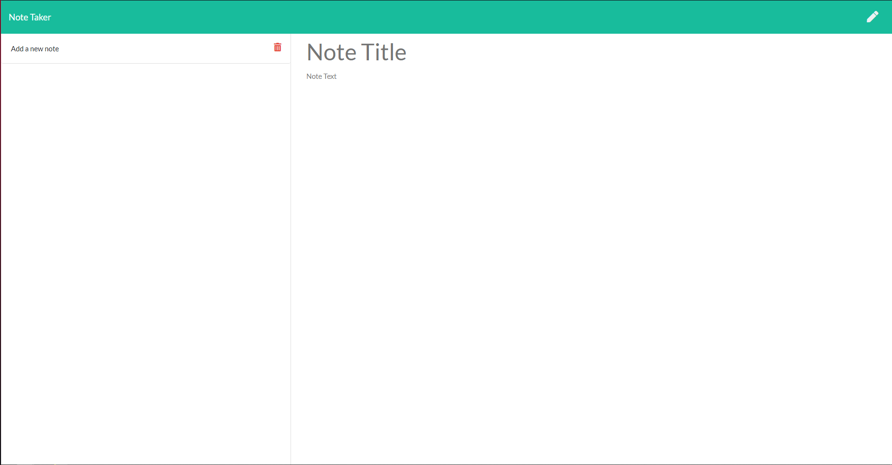

# Express.js Note Taker


## Table of Contents

- [Express.js Note Taker](#expressjs-note-taker)
  - [Table of Contents](#table-of-contents)
  - [Description](#description)
  - [Installation](#installation)
  - [Usage](#usage)
  - [Licence](#licence)
  - [Deployed Heroku Link](#deployed-heroku-link)
  - [Tests](#tests)
  - [Screenshots](#screenshots)

## Description

For this Project we were given the basic HTML, CSS and JS. We were tasked to create the back end of this sit so a user could use it as intended.

To do this, I had to complete the following:

- Creating the necessary routes so that the index page and notes page loaded when particular parts of the website were clicked.
- Added a server file to create a port so the information in the database would be displayed on the site.
- Create the necessary functions which would allow the user to Create, View and Delete notes.
- Deploy the app to Heroku to get the app up and running.

## Installation

```
git clone git@github.com:LeeFarnell/express-note-taker.git
cd express-note-taker
npm install express cors uuid
```

## Usage

Click on the deployed Heroku link to launch the live app. On the landing page, press the 'Get Started' button to start making notes.

## Licence

This content is licenced under the MIT Licence.
https://www.mit.edu/~amini/LICENSE.md

## Deployed Heroku Link

https://mysterious-river-95889.herokuapp.com/notes

## Tests

Tests are not required for this app.

## Screenshots


